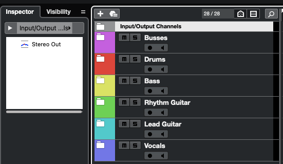
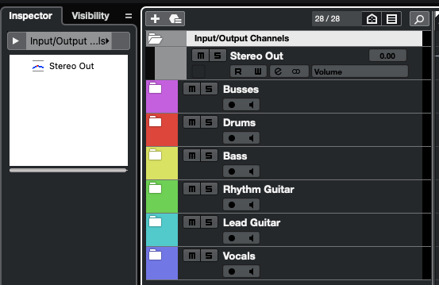
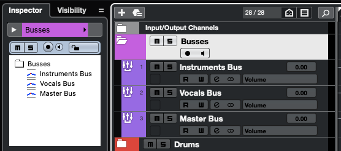
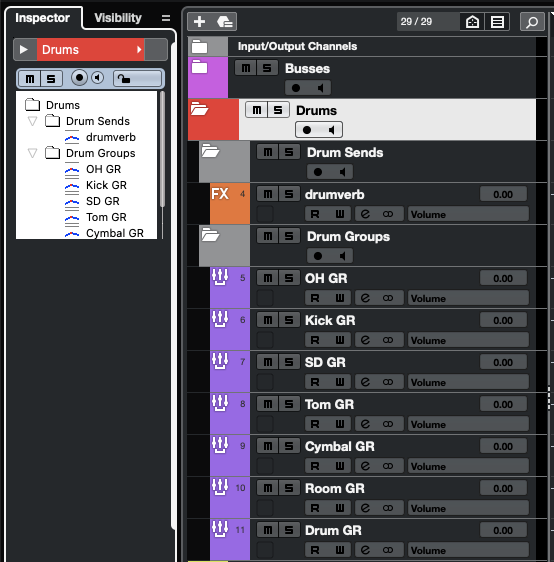
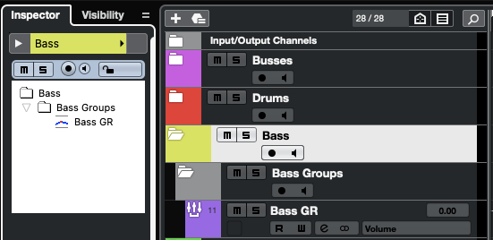
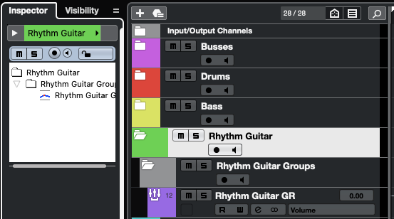
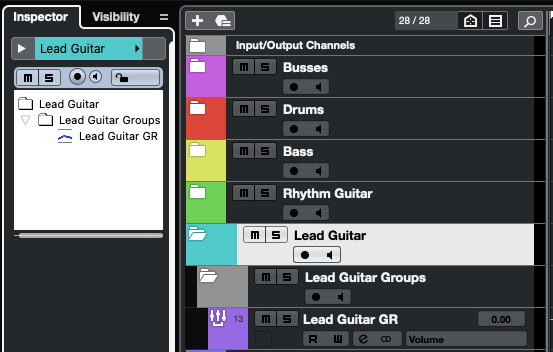
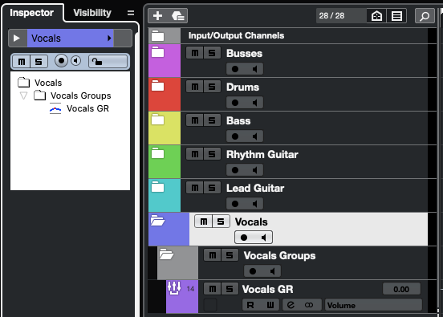

# Matthew Fritz's Standard Cubase Template

This is the standard Cubase Artist 12 template that Matthew Fritz starts with when mixing projects.

This repository is also a template repo on GitHub so you can use my project and file structure immediately when starting your own Cubase projects.

## Table of Contents

* [Overview](#overview)
* [Input / Output Channels](#input--output-channels)
   * [Stereo Out](#stereo-out)
* [Busses](#busses)
   * [Instruments Bus](#instruments-bus)
   * [Vocals Bus](#vocals-bus)
   * [Master Bus](#master-bus)
* [Drums](#drums)
   * [Drum Sends](#drum-sends)
      * [drumverb](#drumverb)
   * [Drum Groups](#drum-groups)
      * [Kick GR](#kick-gr)
      * [SD GR](#sd-gr)
      * [Tom GR](#tom-gr)
      * [Cymbal GR](#cymbal-gr)
      * [Room GR](#room-gr)
      * [Drum GR](#drum-gr)
* [Bass](#bass)
   * [Bass Groups](#bass-groups)
      * [Bass GR](#bass-gr)
* [Rhythm Guitar](#rhythm-guitar)
   * [Rhythm Guitar Groups](#rhythm-guitar-groups)
      * [Rhythm Guitar GR](#rhythm-guitar-gr)
* [Lead Guitar](#lead-guitar)
   * [Lead Guitar Groups](#lead-guitar-groups)
      * [Lead Guitar GR](#lead-guitar-gr)
* [Vocals](#vocals)
   * [Vocals Groups](#vocals-groups)
      * [Vocals GR](#vocals-gr)

## Overview

All of my groups, busses, sends, etc. are based on stereo configurations.

## Input / Output Channels

### Stereo Out

My default is to start with Stereo Out mapped to my Built-In Audio driver since that should be consistent across all systems at a minimum.

I can always change it (and I do) as I work more within a project.

## Busses

I maintain three primary overall busses grouped together in a `Busses` folder.

**Color**: Pink (Color 14)

### Instruments Bus

This is what all instruments _except_ vocals route to when they are output.

**Color**: Violet (Color 13)

**Output Routing**: [Master Bus](#master-bus)

### Vocals Bus

This is what the vocals route to when they are output.

**Color**: Violet (Color 13)

**Output Routing**: [Master Bus](#master-bus)

### Master Bus

This is the bus resulting from all other tracks, groups, and sends when they are output.

**Color**: Violet (Color 13)

**Output Routing**: [Stereo Out](#stereo-out)

## Drums

I keep everything related specifically to drums together in a folder called `Drums`.

**Color**: Red (Color 1)

### Drum Sends

This contains any sends, such as my drum reverb, that the drum tracks use.

#### drumverb

This is an FX track that I use for my drum reverb, typically only on the tracks for the shells individually.

**Color**: Orange (Color 2)

**Output Routing**: [Drum GR](#drum-gr)

### Drum Groups

This contains my drum groups that collect the individual tracks before sending them to the Instruments Bus.

#### Kick GR

This is the group that contains all tracks related to the kick drums.

**Color**: Violet (Color 13)

**Output Routing**: [Drum GR](#drum-gr)

#### SD GR

This is the group that contains all tracks related to the snare drum.

**Color**: Violet (Color 13)

**Output Routing**: [Drum GR](#drum-gr)

#### Tom GR

This is the group that contains all tracks related to the toms.

**Color**: Violet (Color 13)

**Output Routing**: [Drum GR](#drum-gr)

#### Cymbal GR

This is the group that contains all tracks related to the cymbals.

**Color**: Violet (Color 13)

**Output Routing**: [Drum GR](#drum-gr)

#### Room GR

This is the group that contains all tracks related to the overheads or room mics for the drums.

**Color**: Violet (Color 13)

**Output Routing**: [Drum GR](#drum-gr)

#### Drum GR

This is the final group that routes all drum groups to the Instrument Bus.

**Color**: Violet (Color 13)

**Output Routing**: [Instruments Bus](#instruments-bus)

## Bass

I keep everything related to bass guitar specifically in a folder called `Bass`.

**Color**: Yellow (Color 4)

### Bass Groups

This contains my bass groups that collect the individual tracks before sending them to the Instruments Bus.

#### Bass GR

This is the final group that routes all bass groups to the Instruments Bus.

**Color**: Violet (Color 13)

**Output Routing**: [Instruments Bus](#instruments-bus)

## Rhythm Guitar

I keep everything related to rhythm guitar specifically in a folder called `Rhythm Guitar`.

**Color**: Green (Color 6)

### Rhythm Guitar Groups

This contains my rhythm guitar groups that collect the individual tracks before sending them to the Instruments Bus.

#### Rhythm Guitar GR

This is the final group that routes all rhythm guitar groups to the Instruments Bus.

**Color**: Violet (Color 13)

**Output Routing**: [Instruments Bus](#instruments-bus)

## Lead Guitar

I keep everything related to lead guitar specifically in a folder called `Lead Guitar`.

**Color**: Cyan (Color 9)

### Lead Guitar Groups

This contains my lead guitar groups that collect the individual tracks before sending them to the Instruments Bus.

#### Lead Guitar GR

This is the final group that routes all lead guitar groups to the Instrument Bus.

**Color**: Violet (Color 13)

**Output Routing**: [Instruments Bus](#instruments-bus)

## Vocals

I keep everything related to vocals specifically in a folder called `Vocals`.

### Vocals Groups

This contains my vocals groups that collect the individual tracks before sending them to the Vocals Bus.

**Color**: Purple (Color 12)

#### Vocals GR

This is the final group that routes all vocals groups to the Vocals Bus.

**Color**: Violet (Color 13)

**Output Routing**: [Vocals Bus](#vocals-bus)
